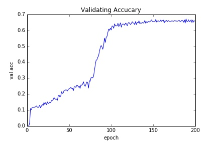

- This repository is only for study, please **do not** use for commercial.

# Theano implementation of LSTM and CTC
- Support GPU accelaration. (Only when the model is complicated enough the GPU acceleration can be seen)
- Support LogCTC, which prevents from overflow issue
- Support batch training, which means that different width of images can be packed into a single mini-batch
- Support prediction alone script, useful to test and release.
- Currently not support CNN feature extraction, as there are plenty framework to do so. Raw pixel features in gray scale are feed directly into LSTM and CTC layers.

# Data format
- **x** is a list of images. The size of each image should have identical height, and the width varies. 
- **x_mask** is a matrix to indicate the valid region of each image. As in a mini-batch, images with different width are packed together, we need extra infomation to store the real width of each image. For example, `[[1, 1, 1, 0, 0], [1, 1, 1, 1, 1]]` represents 2 images, the width of first image is 3 and the second one is 5
- **y** is a matrix, each row is the corresponding label (sequence of chars) of each image.
- **y_clip** is a vector, similar as **x_mask**, however in more compact format. Each element represents the real length of corresponding label. 

# Installation
Ubuntu:

```
sudo apt-get update
sudo apt-get install -y libmagickwand-dev python-opencv
pip install -r requirements.txt
```

Mac OS X:

```
brew tap homebrew/science
brew install opencv
pip install -r requirements.txt
```

Add package path to your environment, for example
`export PYTHONPATH=/path/to/cnn-lstm-ctc/:$PYTHONPATH`

[OpenCV3](http://opencv.org/) is needed

# Get Data
- Pull all codes and data, including **english_sentence.tar.gz** (~21MB) in **dataset** folder
- Extract the files and run [get_data.sh](get_data.sh)
```
cd /path/to/cnn-lstm-ctc/
cd dataset
tar -zxvf english_sentence.tar.gz
cd ..
sh get_data.sh
```

# Train
```
cd /path/to/cnn-lstm-ctc/
sh train.sh
```
A typical validation accuracy curve within 200 epochs, lr=0.01, gamma=0.1, multistep_epoch=[100, 150, 175], cost 28.255 hours. (In this repository only 0.01% data are released due to privacy)



The best result occurs in epoch 188 with 67.152%

# Predict
- After training converged and finished, pick the favorite model in **snapshot** folder, say, **188.pkl**.
- Open [predict.sh](predict.sh) and modify `model_path=snapshot/188.pkl` 
```
cd /path/to/cnn-lstm-ctc/
vim predict.sh
sh predict.sh
```

# Others
- The first time to compile the train and val function in [train/train.py](train/train.py) takes long, maybe 10-15 mins
- For simple english word recognition task, with whole dataset, 92.8% accuracy can be obtained after 200 epoch. 
